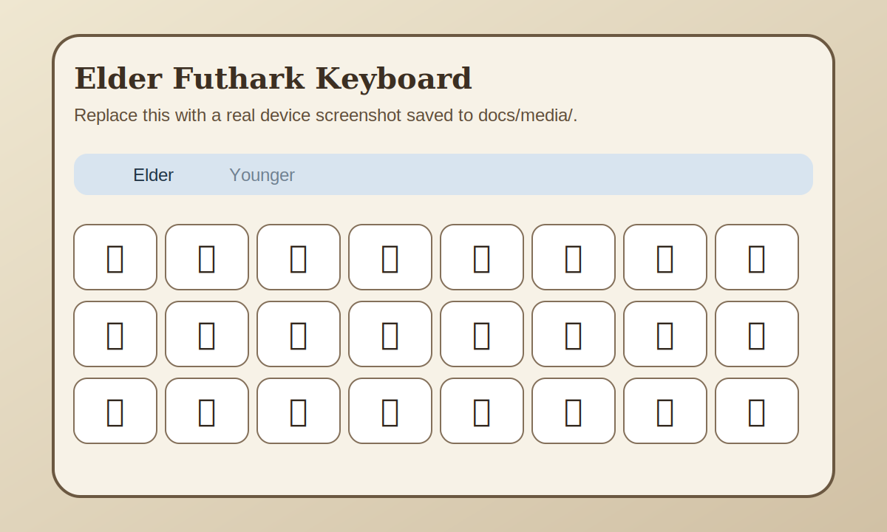
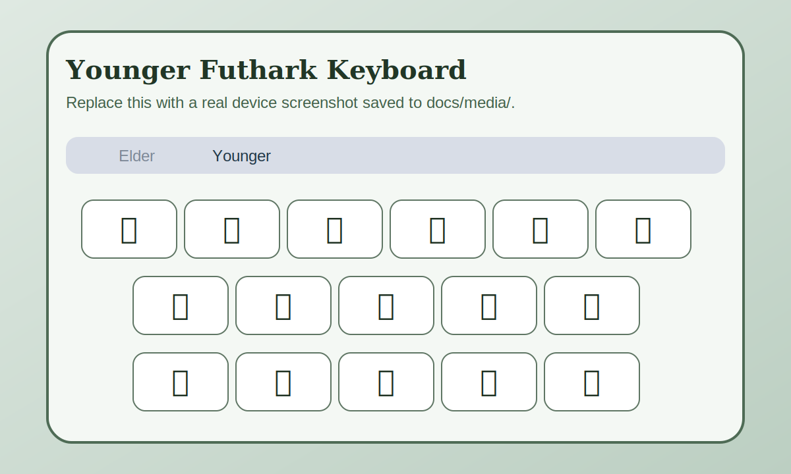
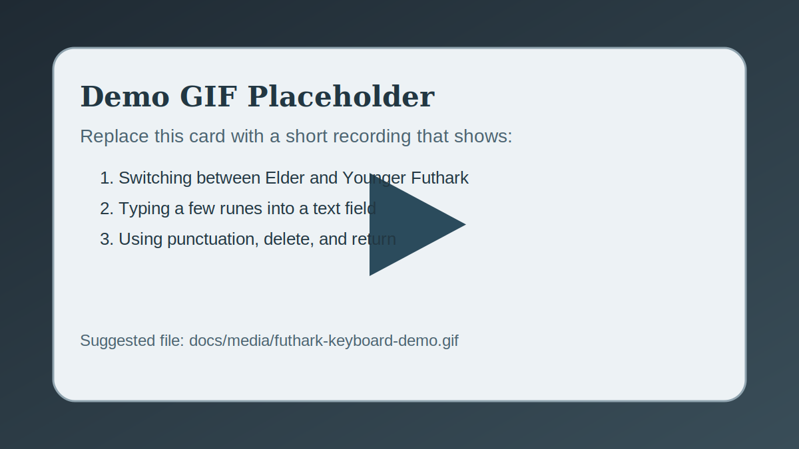

# Futhark Keyboard

Custom iOS keyboard extension for typing Elder and Younger Futhark runes with proper Unicode output.

## Features

- Switch between `Elder` and `Younger` Futhark layouts.
- Inserts exact runic Unicode scalars instead of relying on button labels.
- Includes runic punctuation (`᛫`), space, delete, return, and the standard globe key.
- Does not require Full Access.
- Built as a native iOS keyboard extension with Swift and UIKit.

## Supported Layouts

### Elder Futhark

24 runes:

`ᚠ ᚢ ᚦ ᚨ ᚱ ᚲ ᚷ ᚹ`

`ᚺ ᚾ ᛁ ᛃ ᛇ ᛈ ᛉ ᛊ`

`ᛏ ᛒ ᛖ ᛗ ᛚ ᛜ ᛞ ᛟ`

### Younger Futhark

16 runes:

`ᚠ ᚢ ᚦ ᚬ ᚱ ᚴ`

`ᚼ ᚾ ᛁ ᛅ ᛋ`

`ᛏ ᛒ ᛘ ᛚ ᛦ`

## Requirements

- Xcode 15 or newer
- iOS 17.0 or newer
- A physical iPhone or iPad is recommended for testing the keyboard extension

## Build

1. Open [`Fúthark Keyboard.xcodeproj`](./Fúthark%20Keyboard.xcodeproj).
2. Select the app target and an iPhone or iPad run destination.
3. Build and run from Xcode.
4. If Xcode reports duplicate derived-data outputs after target renames, clean the build folder and rebuild.

## Enable The Keyboard

1. Install and launch the app on your device.
2. Open `Settings > General > Keyboard > Keyboards > Add New Keyboard...`.
3. Choose `Fúthark Keyboard` under third-party keyboards.
4. Open any text field, tap the globe key, and switch to `Fúthark Keyboard`.

`Allow Full Access` is not required for this project because the extension does not request open access.

## Screenshots

These are placeholder media panels wired for GitHub. Replace them with real device captures in `docs/media/` when you have them.

## Demo GIF

Replace the placeholder below with a recorded demo such as `docs/media/futhark-keyboard-demo.gif` once you have a device capture.

## Project Structure

- [`Fu_thark_KeyboardApp.swift`](./Fúthark%20Keyboard/Fu_thark_KeyboardApp.swift): host app entry point
- [`ContentView.swift`](./Fúthark%20Keyboard/ContentView.swift): host app UI
- [`KeyboardViewController.swift`](./Fúthark%20Keyboard/KeyboardViewController.swift): keyboard extension layout and rune insertion logic
- [`Info.plist`](./Fúthark%20Keyboard/Info.plist): keyboard extension configuration
- [`docs/media`](./docs/media): README media assets

## Implementation Notes

- Rune keys are modeled with explicit Unicode code points to avoid normalization and substitution issues.
- The keyboard UI is built programmatically with UIKit.
- The extension currently targets direct rune entry, not transliteration or predictive text.

## Roadmap

- Add a better host app for previewing and testing layouts
- Add iPad-specific layout tuning
- Add automated tests for rune mappings and insertion behavior

## License

Released under the MIT License. See [`LICENSE`](./LICENSE).
